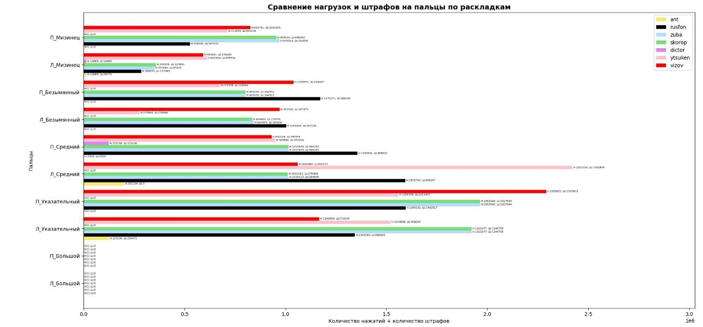
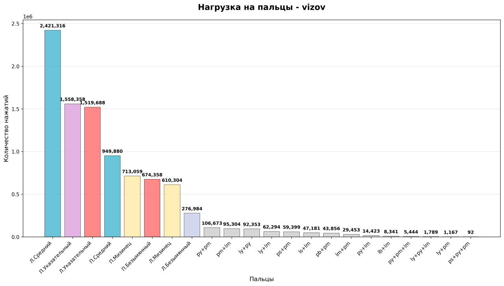
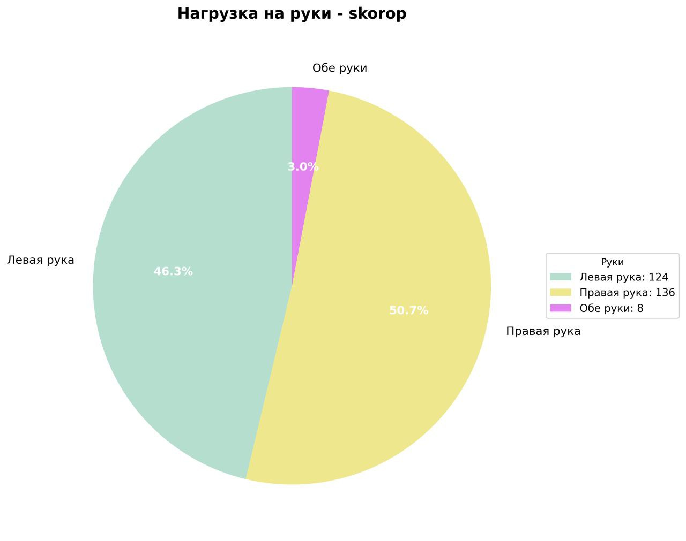

# Описание проекта
Наш проект анализирует входной текст с разными раскладками клавиатуры и помогает определить, какая раскладка наиболее эффективна для конкретного пользователя при помощи python и консольной утилиты.
## 🚀 Установка и запуск KVA

### Быстрый старт

### 1. Установка зависимостей
```bash
uv sync
```

### 2. Проверка проекта
```bash
python check_project.py
```

### 3. Запуск программы
```bash
uv run main.py
```

## Подробная установка

### Требования
- Python 3.13 или выше
- uv (менеджер пакетов Python)
  

### Проверка установки
```bash
# Проверка импортов
uv run test_imports.py

# Полная проверка проекта
uv run check_project.py
```

## Первый запуск

1. **Запустите программу:**
   ```bash
   uv run main.py
   ```

2. **Выберите раскладку:**
   - В меню выберите "1) Выбрать раскладку для тестирования"
   - Выберите "test_en" (создается автоматически)

3. **Проанализируйте файл:**
   - Выберите "1) Обработать файл со словами"
   - Укажите путь к файлу (например: `test_words.txt`)

4. **Сохраните результаты:**
   - Выберите нужные опции экспорта
   - Графики сохранятся в папку `reports/`

## Примеры файлов

### Тестовые файлы:
- `test_words.txt` - небольшой файл для тестирования

### Примеры раскладок:
- `example_layouts/qwerty_layout.json` - QWERTY в JSON
- `example_layouts/dvorak_layout.csv` - Dvorak в CSV  
- `example_layouts/colemak_layout.txt` - Colemak в TXT

### Примеры графиков:




## Структура проекта

```
KVA/
├── main.py                 # 🎯 Главный файл
├── requirements.txt        # 📦 Зависимости
├── check_project.py       # 🔍 Проверка проекта
├── database_module/       # 💾 Работа с БД
├── scan_module/           # 📖 Чтение файлов
├── processing_module/     # ⚙️  Обработка данных
├── data_module/           # 📊 Экспорт и графики
├── example_layouts/       # 📝 Примеры раскладок
└── reports/              # 📈 Отчеты и графики
```

## Возможные проблемы


### Ошибка "No module named 'tkinter'"
```bash
# Ubuntu/Debian  
sudo apt-get install python3-tk

# CentOS/RHEL
sudo yum install tkinter
```

### Проблемы с кодировкой
- Убедитесь, что файлы сохранены в UTF-8
- Для Windows может потребоваться указать кодировку

## Получение помощи

1. **Запустите диагностику:** `python check_project.py`
2. **Проверьте импорты:** `python test_imports.py`

---

*Создано командой TEAM RATS 🐭*
