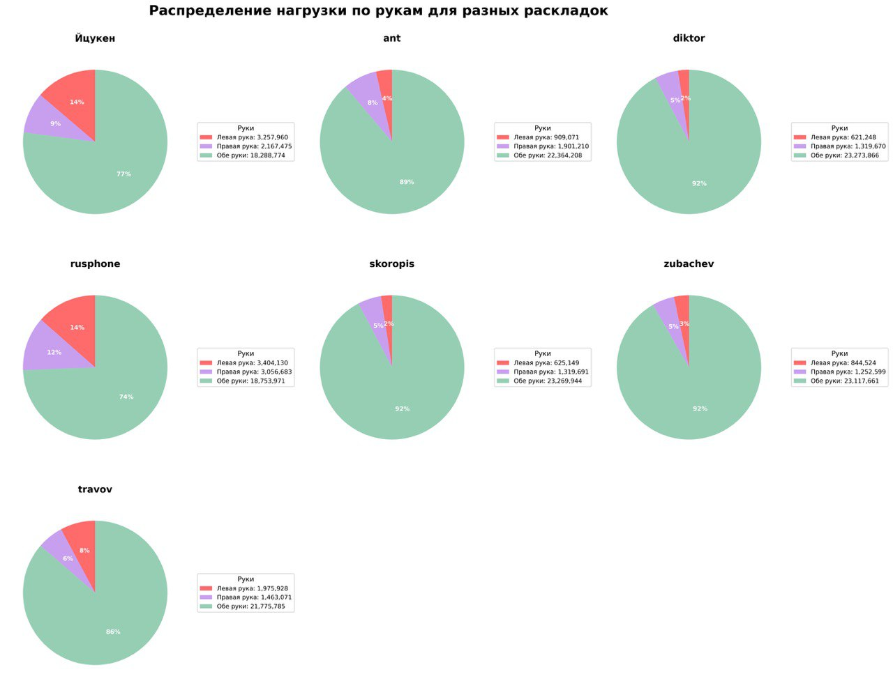
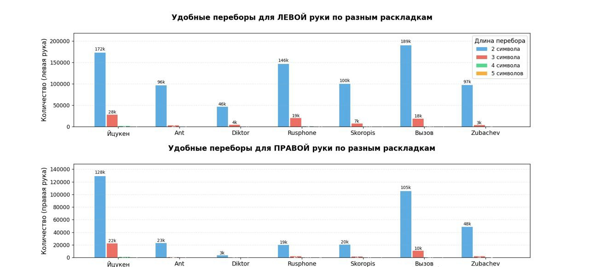
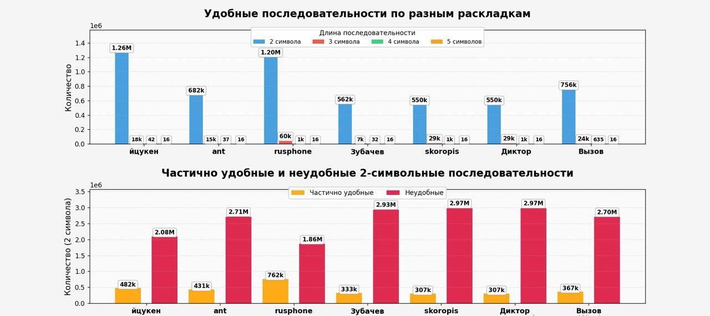
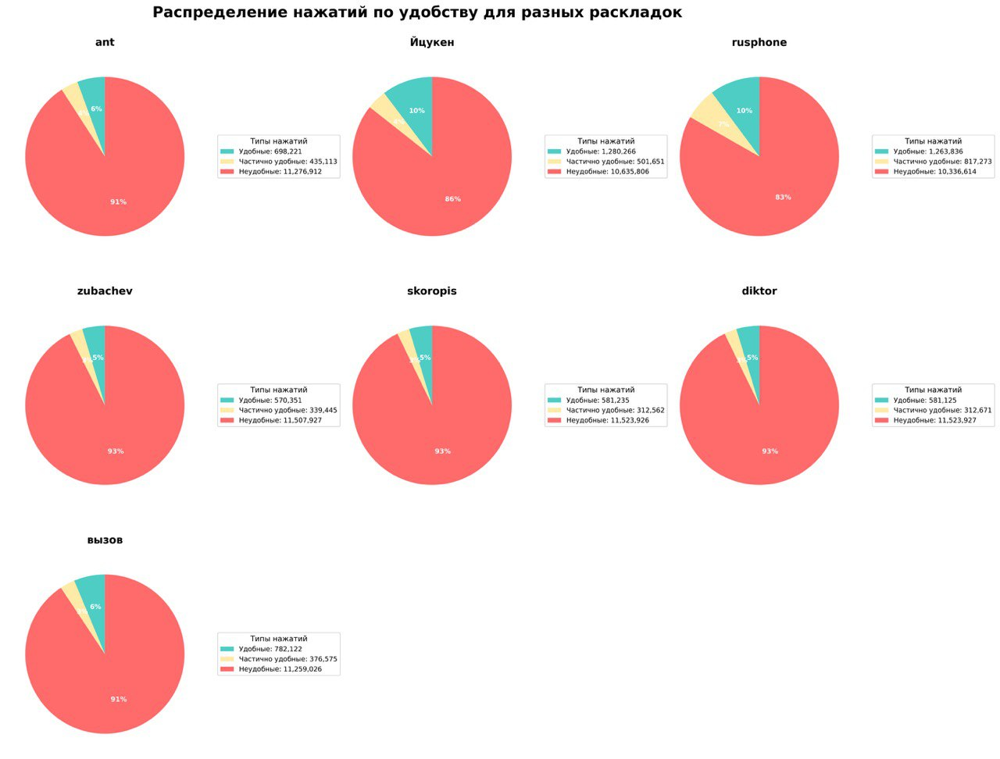

# Описание проекта
Наш проект анализирует входной текст с разными раскладками клавиатуры и помогает определить, какая раскладка наиболее эффективна для конкретного пользователя при помощи python и консольной утилиты. 
Анализируемые раскладки:
1)  <ins>**ЙЦУКЕН**</ins> - стандартная раскладка
2)  <ins>**Диктор**</ins> - оптимизированная для частотности букв
3)  <ins>**Вызов**</ins> - радикальный подход с двухсимвольными клавишами
4)  <ins>**Зубачёв**</ins> - эргономичная раскладка Сергея Зубачёва
5)  <ins>**Скоропись**</ins> - раскладка для скоростной печати
6)  <ins>**Русская фонетическая**</ins> - основанная на фонетическом принципе
7)  <ins>**АНТ**</ins> - антропоморфная типографская раскладка

## Используемые метрики:
1) Штрафы за сложность переходов - оценка трудности перемещений между клавишами
2) Количества нажатий клавиш и переходов между руками
3) Анализ частых сочетаний символов
4) Оценка удобства переборов:
      * удобный перебор - одноручные последовательности с направлением пальцев от внешнего к внутреннему
      * частично удобный перебор - одноручные последовательности со сменой направления
      * неудобный перебор - смена рук
5) Эргономичность

## 🚀 Установка и запуск KVA

### Быстрый старт

### 1. Установка зависимостей
```bash
uv sync
```

### 2. Проверка проекта
```bash
python check_project.py
```

### 3. Запуск программы
```bash
uv run main.py
```

## Подробная установка

### Требования
- Python 3.13 или выше
- uv (менеджер пакетов Python)
  

### Проверка установки
```bash
# Проверка импортов
uv run test_imports.py

# Полная проверка проекта
uv run check_project.py
```

## Первый запуск

1. **Запустите программу:**
   ```bash
   uv run main.py
   ```

2. **Выберите раскладку:**
   - В меню выберите "1) Выбрать раскладку для тестирования"
   - Выберите "test_en" (создается автоматически)

3. **Проанализируйте файл:**
   - Выберите "1) Обработать файл со словами"
   - Укажите путь к файлу (например: `test_words.txt`)

4. **Сохраните результаты:**
   - Выберите нужные опции экспорта
   - Графики сохранятся в папку `reports/`

## Примеры файлов

### Тестовые файлы:
- `test_words.txt` - небольшой файл для тестирования

### Примеры раскладок:
- `example_layouts/qwerty_layout.json` - QWERTY в JSON
- `example_layouts/dvorak_layout.csv` - Dvorak в CSV  
- `example_layouts/colemak_layout.txt` - Colemak в TXT

### Примеры графиков:







## Структура проекта

```
KVA/
├── main.py                 # 🎯 Главный файл
├── requirements.txt        # 📦 Зависимости
├── check_project.py       # 🔍 Проверка проекта
├── database_module/       # 💾 Работа с БД
├── scan_module/           # 📖 Чтение файлов
├── processing_module/     # ⚙️  Обработка данных
├── data_module/           # 📊 Экспорт и графики
├── example_layouts/       # 📝 Примеры раскладок
└── reports/              # 📈 Отчеты и графики
```

## Возможные проблемы


### Ошибка "No module named 'tkinter'"
```bash
# Ubuntu/Debian  
sudo apt-get install python3-tk

# CentOS/RHEL
sudo yum install tkinter
```

### Проблемы с кодировкой
- Убедитесь, что файлы сохранены в UTF-8
- Для Windows может потребоваться указать кодировку

## Получение помощи

1. **Запустите диагностику:** `python check_project.py`
2. **Проверьте импорты:** `python test_imports.py`

## Вывод
Проведен анализ 7 русских клавиатурных раскладок. Для каждой раскладки оценены эргономические показатели, включая комфортность набора биграмм и триграмм, нагрузку на пальцы, использование модификаторов.

### Общая комфортность набора (по всем последовательностям)

**Рейтинг по проценту комфортных последовательностей:**
1. ЙЦУКЕН (стандартная) - 10.31%
2. русфон - 10.18%
3. Вызов - 6.30%
4. Ант - 5.63%
5. скоропись - 4.68%
6. диктор - 4.68%
7. зубачев - 4.59%

**Рейтинг по проценту некомфортных последовательностей (чем меньше, тем лучше):**
1. русфон - 83.24%
2. ЙЦУКЕН (стандартная) - 85.65%
3. Вызов - 90.67%
4. Ант - 90.87%
5. зубачев - 92.67%
6. скоропись - 92.80%
7. диктор - 92.80%

### Распределение нагрузки на пальцы

**Нагрузка на два самых загруженных пальца (чем меньше, тем лучше):**
1. скоропись - 39.43%
2. Ант - 43.18%
3. Вызов - 43.75%
4. ЙЦУКЕН (стандартная) - 44.26%
5. диктор - 44.09%
6. зубачев - 44.86%
7. русфон - 45.36%

**Максимальное расстояние нажатия (чем меньше, тем лучше):**
- <ins>4 позиции</ins>: ЙЦУКЕН, зубачев, скоропись, диктор, Вызов
- <ins>5 позиций</ins>: Ант, русфон

### Использование модификаторов (Shift/Alt)

**Процент последовательностей с модификаторами:**
1. скоропись - 4.49%
2. ЙЦУКЕН (стандартная) - 4.49%
3. Ант - 4.49%
4. зубачев - 4.65%
5. русфон - 4.84%
6. диктор - 4.96%
7. Вызов - 11.01% (значительно выше всех)

## Детальный анализ раскладок

**ЙЦУКЕН (стандартная)**
- *Сильные стороны:* Лучший процент комфортных последовательностей (10.31%), привычная для большинства пользователей
- *Слабые стороны:* Высокая нагрузка на мизинец правой руки (25.14%)
- *Топ комфортных биграмм:* "но", "ро", "ва", "ск", "ка"
- *Топ некомфортных биграмм:* "ст", "ов", "ен", "ра", "ко"

**русфон**
- *Сильные стороны:* Второй по комфортности (10.18%), наименьший процент некомфортных последовательностей (83.24%)
- *Слабые стороны:* Наибольшая нагрузка на два пальца (45.36%), максимальное расстояние 5 позиций
- *Топ комфортных биграмм:* "ст", "ер", "ны", "ли", "по"
- *Топ некомфортных биграмм:* "ов", "ен", "ро", "ал", "ан"

**скоропись**
- *Сильные стороны:* Наименьшая нагрузка на два пальца (39.43%), минимальное использование модификаторов
- *Слабые стороны:* Низкий процент комфортных последовательностей (4.68%), высокий процент некомфортных (92.80%)
- *Топ комфортных биграмм:* "ст", "ск", "нн", "ие", "тв"
- *Топ некомфортных биграмм:* "ов", "но", "ен", "ра", "ро"

**Вызов**
- *Сильные стороны:* Хороший баланс нагрузки, третий по комфортности среди всех
- *Слабые стороны:* Очень высокое использование модификаторов (11.01%)
- *Топ комфортных биграмм:* "ст", "пр", "ка", "нн", "ся"
- *Топ некомфортных биграмм:* "ов", "но", "ен", "ра", "ро"

**диктор**
- *Сильные стороны:* Умеренная нагрузка на пальцы
- *Слабые стороны:* Очень высокий процент некомфортных последовательностей (92.80%)
- *Топ комфортных биграмм:* "ст", "ск", "нн", "ие", "тв"
- *Топ некомфортных биграмм:* "ов", "но", "ен", "ра", "ро"

**зубачев**
- *Сильные стороны:* Умеренная нагрузка на пальцы
- *Слабые стороны:* Худший процент комфортных последовательностей (4.59%)
- *Топ комфортных биграмм:* "ст", "пр", "нн", "го", "ая"
- *Топ некомфортных биграмм:* "ов", "но", "ен", "ра", "ро"

**Ант**
- *Сильные стороны:* Низкая нагрузка на два пальца (43.18%)
- *Слабые стороны:* Низкий процент комфортных последовательностей (5.63%), максимальное расстояние 5 позиций
- *Топ комфортных биграмм:* "ст", "ко", "пр", "ка", "нн"
- *Топ некомфортных биграмм:* "ов", "но", "ен", "ра", "ро"

### Анализ по длине последовательностей

**Биграммы (2 символа):**
- *Наиболее комфортные:* ЙЦУКЕН (32.96%) > русфон (31.39%) > Вызов (19.77%)
- *Наименее комфортные:* скоропись (14.38%) ≈ диктор (14.38%) < зубачев (14.69%)

**Триграммы (3 символа):**
- *Наиболее комфортные:* русфон (1.82%) > скоропись (0.87%) ≈ диктор (0.87%)

## Рекомендации

### **Для начинающих и обычных пользователей**

 **ЙЦУКЕН** (стандартная) остается оптимальным выбором благодаря:
- Наибольшему проценту комфортных последовательностей (10.31%)
- Привычности расположения символов
- Умеренному использованию модификаторов

### **Для профессиональных наборщиков**, минимизирующих усталость

**скоропись** имеет преимущества:
- Наименьшая нагрузка на два пальца (39.43%)
- Минимальное использование модификаторов

### **Для пользователей, ценящих комфорт частых последовательностей**

**русфон** показывает:
- Наименьший процент некомфортных последовательностей (83.24%)
- Второй процент комфортных последовательностей (10.18%)

### **Для экспериментаторов, готовых к обучению**

**Вызов** предлагает:
- Третий лучший процент комфортных последовательностей (6.30%)
- Но требует привыкания к высокому использованию модификаторов (11.01%)

### **Не рекомендуется**

**зубачев** имеет наихудшие показатели по комфортным последовательностям (4.59%).

## Итог

Нет раскладки, которая бы лидировала по всем показателям одновременно.

Выбор раскладки должен учитывать не только объективные метрики, но и субъективный комфорт, привычки и специфику текстов, которые набираются чаще всего.

---

*Создано командой TEAM RATS 🐭*
